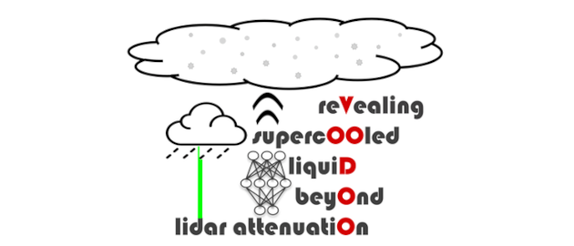

# VoodooNet
Predicting liquid droplets in mixed-phase clouds beyond lidar attenuation using artificial neural nets and Doppler cloud radar spectra



## Prerequisites

### Python

VoodooNet requires Python3.10.

### Torch

Before installing `VoodooNet`, install `torch` [according to your infrastructure](https://pytorch.org/get-started/locally/). For example,
```sh
pip3 install torch --extra-index-url https://download.pytorch.org/whl/cpu
```

## Basic usage
```python
import voodoonet
import glob

rpg_files = glob.glob('/path/to/rpg/files/*.LV0')
probability_liquid = voodoonet.run(rpg_files)
```
